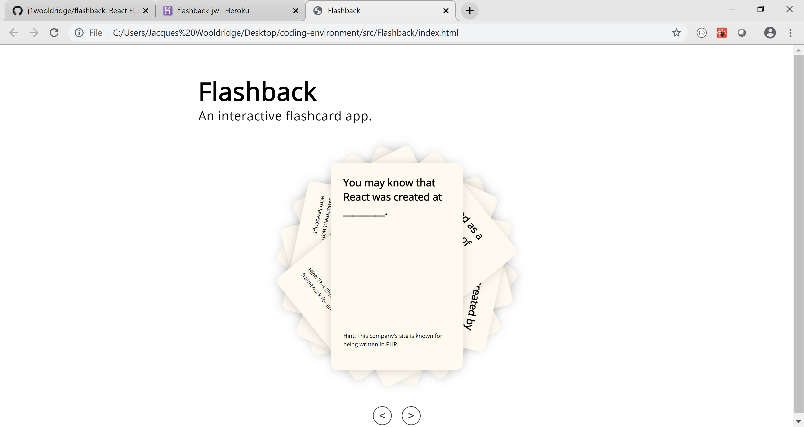

# README

Flaskback is an interactive flashcard app that teaches users about the history of the React user interface library. The goal was to build a basic html, css and javascript page to highlight skills aquired during my full stack web developer course.

Deployed Version

Visit https://flashback-jw.herokuapp.com/ to deploy the app.

Screenshot Version

 

Jacques Wooldridge.

